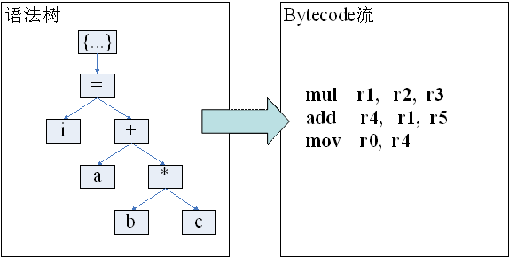

# 博客阅读

## [浅析JavaScript引擎的技术变迁](http://djt.qq.com/article/view/489)
- 浏览器与JavaScript引擎

| 浏览器      | JavaScript引擎   |  发布时间  |
| --------    | -----: 		     | :----:     |
| Firefox 3.5 | TraceMonkey      |   2009     |
| Chrome	  | V8      		 |   2008     |
| Safari  	  | Nitro		     |   2008     |
| Opera		  | CaraKan      	 |   2009     |
| IE		  | Chakra      	 |   2010     |

- 遍历语法树（Syntax Tree Walker)  
执行一条语句的过程就是遍历一次相对应的语法树的过程。  
每次执行这条语句，都要进行一次遍历树的过程，这种方式存在着很大的性能缺陷：
	+ 语法树只是描述语法结构，并不是执行这条语句要进行的操作。
	+ 访问每个节点的代价太大。遍历语法树一般采用访问者模式，访问每个节点至少需要一次虚函数调用和返回，也即有两个间接跳转，而对于现代CPU而言，这种间接跳转意味着大大增加了分支预测失败的可能行。

- 字节码（bytecode）  
如果在后序遍历这棵树后，生成对应的后缀记法（逆波兰式）的操作序列，然后在执行时，直接解释执行这个后缀记法的操作序列。那么这时候就把这种树状结构，变换成了一种线性结构。这种操作序列就是字节码（bytecode）

JavaScript字节码在设计上大体上都可归类为以下两类：基于栈(stack-based)和基于寄存器（register-based）  
传统的字节码设计大多是基于栈的，这种方式将所有的操作数和中间表示都保存在一个数据栈中。  
基于寄存器的字节码通过一些槽（slot）或称为寄存器（register）的方式保存操作数。
这里的寄存器与汇编代码中的寄存器是两个概念。存在寄存器（或槽）中可以想象成就是存入一个固定数组中了。  
与遍历语法树方式相比，字节码方式就消除了遍历语法树所引起的大部分性能负担。首先字节码序列直接描述了需要执行的动作，去除了多余的语法信息；其次，执行一条字节码语句，只是一次的内存访问（取指令）再加上一次间接跳转（分派到对应的处理函数），这也比访问语法树中一个节点开销来的要小。

- Direct Threading
以这种方式执行时，每执行完一条指令后不是回到循环的开始，而是直接跳到下一条要执行的指令地址。

- 即时编译(Just-In-Time)  
解释执行则是每次运行的时候，将每条源代码（如python, javascript）翻译成相应的机器码并立刻执行，并不保存翻译后的机器码，周而复始。
解释执行的运行效率很低，因为每次执行都需要逐句地翻译成机器码然后执行；而静态编译在运行前就编译成相应平台的代码。  
JIT编译则是这两种方式的混合，在运行时将源代码翻译成机器码（这一点与解释执行类似），但是会保存已翻译的机器代码，下次执行同一代码段时无需再翻译（这又与静态编译类似）。    
所以一般情况下，JavaScript引擎并不是对所有代码都会生成机器码，而是只对热点（hot spot）片段进行即时编译，同时在运行中会随时跟踪热点的状态，如果热点的程度越高（被执行得越频繁），实施的优化也越激进。

